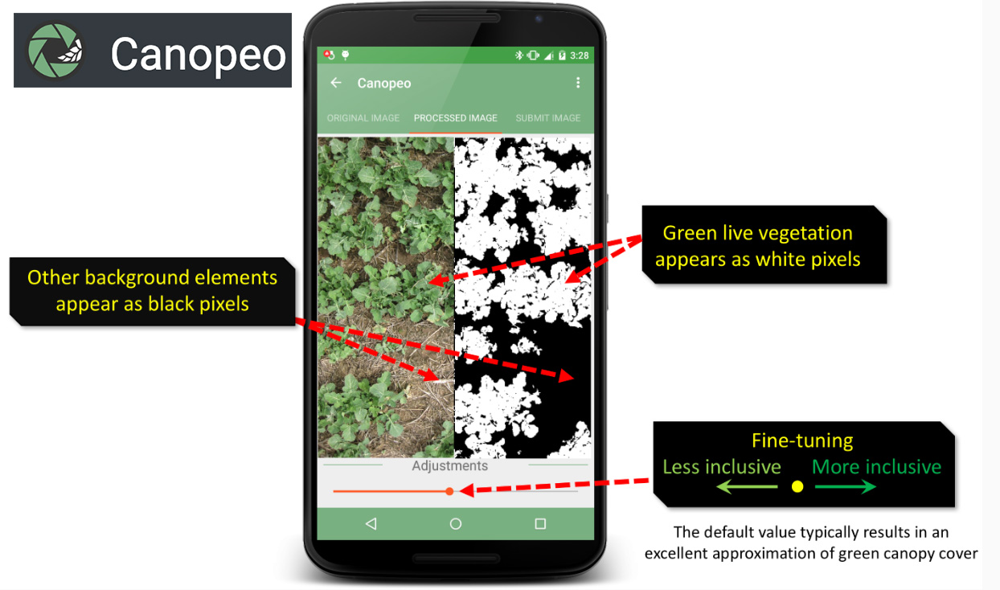
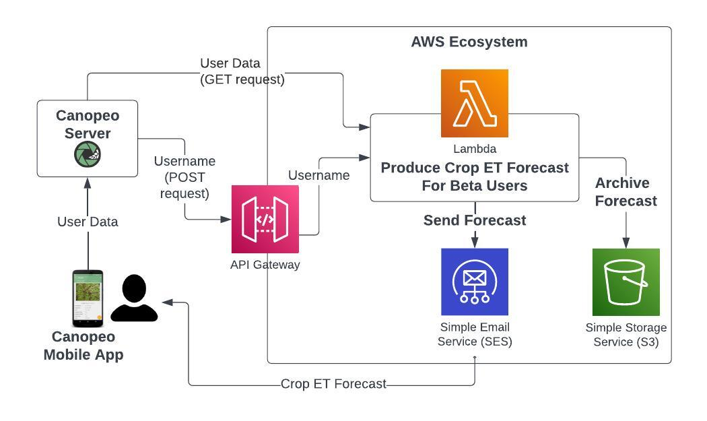

# Orchestrating ET Forecast Delivery

**Our Aim: A Globally-Available, Locally-Tailored Crop ET Forecast Tool**

This code is a part of our overall goal of developing a globally-available, locally-tailored crop evapotranspiration forecast tool. See [section below](#proof-of-concept-on-aws) for more info on what the code in this repo does.

## Motivation
Irrigation accounts for and estimated 70% of freshwater use globally[^1]. However, local crop ET forecasts are currently unavailable for most farmers around the world. This is despite the fact that technology for generating and communicating (on the part of scientists, engineers, and technologists), and receiving (on the part of farmers) crop ET forecasts has never been more accessible.

## Approach
Our approach for developing a globally-available, locally-tailored crop ET forecast tool uses the existing [Canopeo app](canopeoapp.com) and AWS.

### Canopeo Mobile App
Canopeo is a cross-platform mobile app that uses top-down photographs to estimate green canopy cover. The app collects certain information that is key to forecasting crop ET including
- user geolocation
- crop type
- crop planting date
- crop height

### Proof-of-concept on AWS
Before investing in modifying the Canopeo mobile app we are making a proof-of-concept system to deliver ET forecasts to users and collect feedback. This system is being implemented on AWS using several AWS products including
- API Gateway
- Lambda
- Simple Storage Service (S3)
- Simple Emails Service (SES)

The Lambda function is what this repo is set up to track. It is performs the following steps:
1. Receive username from API Gateway
2. Check if username is on the “beta” user list
3. If “beta” user, retrieve user data from server:
	- photo
	- geo-location
	- email
	- crop info
4. Calculate CropET forecast
5. Fetch weather forecast based on geolocation
6. Forecast crop growth stage (based on planting date and crop type)
7. Email CropET forecast
8. Archive forecast and user data

[^1]:https://www.usgs.gov/special-topics/water-science-school/science/irrigation-water-use`

